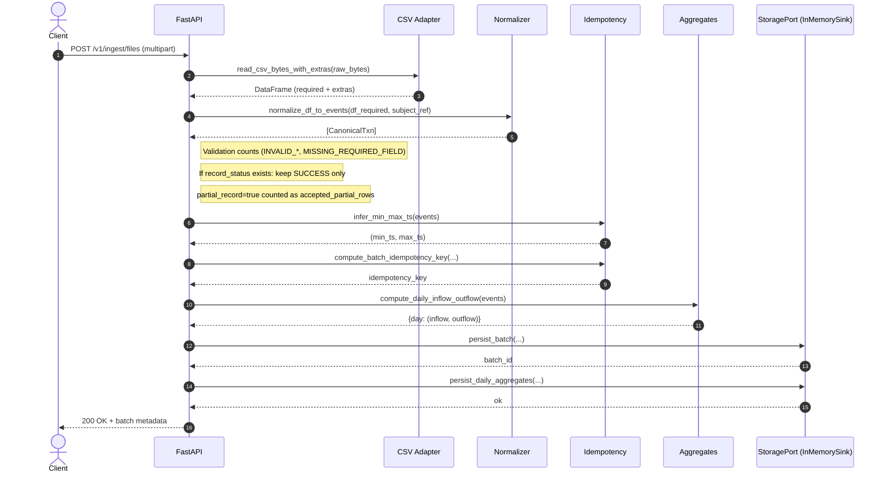
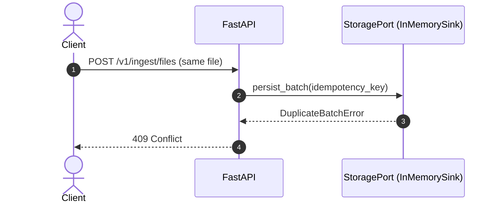
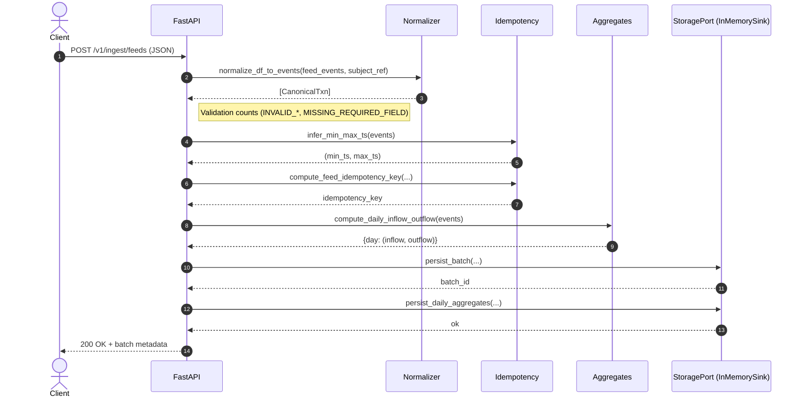

# Architecture

This document describes the current ingestion architecture, processing stages, and data contracts. It includes sequence diagrams and concrete input/output examples. The system is designed to be regulatory-safe: raw transaction data is processed in-memory only, and only derived outputs are persisted.

## Goals
- Provide a deterministic ingestion boundary for MSME cash-flow data.
- Enforce strict data minimization (derived-only persistence).
- Support idempotent ingestion and pluggable storage.
- Stay extensible for future feeds (UPI, AA, bank) without redesign.

## Non-Negotiable Constraints
- No raw transaction data at rest.
- No statements, narrations, UPI IDs, account numbers, or counterparty identifiers.
- Derived-only persistence.
- Deterministic idempotency and duplicate batch rejection.
- Storage must remain pluggable via `StoragePort`.

## High-Level Components
- `cashflow_ingest/api/app.py`: FastAPI app and dependency wiring.
- `cashflow_ingest/api/routes_ingest.py`: `/v1/ingest/files` endpoint and orchestration.
- `cashflow_ingest/ingest/adapters/csv_file.py`: CSV parsing and required-column enforcement.
- `cashflow_ingest/ingest/pipeline/normalizer.py`: row normalization and validation.
- `cashflow_ingest/ingest/pipeline/idempotency.py`: deterministic idempotency key.
- `cashflow_ingest/ingest/pipeline/aggregates.py`: derived daily aggregates.
- `cashflow_ingest/ingest/pipeline/storage_port.py`: storage interface.
- `cashflow_ingest/ingest/pipeline/memory_sink.py`: in-memory storage adapter.

## Sequence Diagrams

### 1) Successful CSV Ingestion


### 2) Duplicate Batch Rejection


### 3) Successful Feed Ingestion (JSON)


## Stage-by-Stage Inputs and Outputs
Examples below show shape only; raw identifiers are not persisted and should not be logged.

### Stage 1: HTTP Ingress
**Input (multipart form):**
- `subject_ref`: `mrc_001`
- `source`: `PAYTM`
- `file`: `transactions.csv` (bytes)

**Output:**
- Raw file bytes (in-memory only)
- `file_hash_sha256`: `e3b0c44298fc1c149...`

**Input (JSON feed):**
- `subject_ref`, `source`, `watermark_ts`
- `events[]` of canonical fields

### Stage 2: CSV Adapter (`read_csv_bytes_with_extras`)
**Input:**
- CSV bytes

Example CSV (minimal schema):
```
merchant_id,ts,amount,direction,channel
MRC-001,2025-11-05T09:01:00+05:30,120.50,credit,UPI
MRC-001,2025-11-05T12:45:10+05:30,80.00,debit,BANK
```

**Output:**
- DataFrame with required columns and any extras (if present).
- Required columns are enforced.

### Stage 3: Normalizer (`normalize_df_to_events`)
**Input:**
- DataFrame with required columns

**Output (in-memory only):**
```
[
  CanonicalTxn(
    subject_ref="mrc_001",
    merchant_id="MRC-001",
    event_ts=2025-11-05T09:01:00+05:30,
    amount=120.50,
    direction="credit",
    channel="UPI"
  ),
  CanonicalTxn(
    subject_ref="mrc_001",
    merchant_id="MRC-001",
    event_ts=2025-11-05T12:45:10+05:30,
    amount=80.00,
    direction="debit",
    channel="BANK"
  )
]
```
Validation failures are counted and rejected per row.

### Stage 4: Status Gate (Optional)
**Input:**
- `record_status` column (if present)

**Output:**
- Only rows with `record_status == SUCCESS` proceed.
- Rejection counts by reason: `FAILED_INSUFFICIENT_FUNDS`, `FAILED_TIMEOUT`, `FAILED_NETWORK`, `INVALID_TOKEN`, `UNKNOWN_STATUS` (includes unexpected values like `PARTIAL_RECORD`).

### Stage 5: Partial Quality Flag (Optional)
**Input:**
- `partial_record` column (if present, boolean-ish)

**Output:**
- Does not affect acceptance.
- Rows with `partial_record == true` are accepted if otherwise valid.
- Counted as `accepted_partial_rows`.

### Stage 6: Idempotency (`compute_batch_idempotency_key`)
**Input:**
- `subject_ref`, `source`
- `file_hash_sha256`
- `min_ts`, `max_ts`

**Output:**
- `idempotency_key`: `sha256(subject_ref|source|file_hash|min_date|max_date)`

### Stage 6b: Feed Idempotency (`compute_feed_idempotency_key`)
**Input:**
- `subject_ref`, `source`
- `watermark_ts`
- `min_ts`, `max_ts`
- `event_count`
- `payload_hash`

**Output:**
- `idempotency_key`: `sha256(subject_ref|source|watermark|min_ts|max_ts|event_count|payload_hash)`

### Stage 7: Aggregation (`compute_daily_inflow_outflow`)
**Input:**
- `[CanonicalTxn]`

**Output (derived only):**
```
{
  2025-11-05: (120.50, 80.00)
}
```

### Stage 8: Storage (`StoragePort`)
**Input:**
- Batch metadata: subject, source, filename, file hash, idempotency key, rows accepted/rejected, date range
- Daily aggregates: `day -> (inflow, outflow)`

**Output:**
- `batch_id` (int)

**Persistence Scope:**
- Only derived aggregates and batch metadata.
- No row-level transaction data stored.

## API Responses (Examples)
### Success (`200 OK`)
```json
{
  "status": "INGESTED_DERIVED_ONLY",
  "batch_id": 1,
  "subject_ref": "mrc_001",
  "source": "PAYTM",
  "filename": "transactions.csv",
  "file_hash_sha256": "e3b0c44298fc1c149...",
  "idempotency_key": "c1b3...9a2f",
  "rows_accepted": 2,
  "rows_rejected": 0,
  "rejection_breakdown": {},
  "accepted_partial_rows": 0,
  "range": { "min_ts": "2025-11-05T09:01:00+05:30", "max_ts": "2025-11-05T12:45:10+05:30" },
  "daily_aggregate_days": 1
}
```

### Feed Success (`200 OK`)
```json
{
  "status": "INGESTED_DERIVED_ONLY",
  "batch_id": 2,
  "subject_ref": "mrc_001",
  "source": "PAYTM",
  "idempotency_key": "7af1...c9e3",
  "rows_accepted": 2,
  "rows_rejected": 0,
  "rejection_breakdown": {},
  "watermark_ts": "2025-11-06T00:00:00+05:30",
  "range": { "min_ts": "2025-11-05T09:01:00+05:30", "max_ts": "2025-11-05T12:45:10+05:30" },
  "daily_aggregate_days": 1
}
```

### Duplicate (`409 Conflict`)
```json
{ "detail": "batch already ingested: <idempotency_key>" }
```

### Validation Failure (`400 Bad Request`)
```json
{
  "error": "no valid rows after filtering/validation",
  "rows_accepted": 0,
  "rows_rejected": 3,
  "rejection_breakdown": { "INVALID_AMOUNT": 3 }
}
```

### Low Acceptance Ratio (`400 Bad Request`)
```json
{
  "error": "accepted_ratio below minimum threshold",
  "rows_accepted": 12,
  "rows_rejected": 450,
  "rejection_breakdown": { "INVALID_AMOUNT": 450 },
  "accepted_ratio": 0.0267,
  "min_accept_ratio": 0.1
}
```

## Extension Points
- `StoragePort`: add a `PostgresSink` without changing API behavior.
- Additional feed adapters: future JSON or event ingestion can reuse normalizer and aggregation.
