## 3.0 Data Storage Policy (RBI / AA Minimization)

**No Raw Subject Data at Rest**
- Raw transactions, bank statements, and payer identifiers must never be persisted.
- Only aggregated features and analytic or risk output packets are stored.
- Temporary input handling must be ephemeral with TTL and purge enforced.
- Audit logs store metadata only and must exclude PII or raw payloads.

# Canonical Mermaid Diagrams (Rich Labels)

These are the **canonical** versions of key diagrams with richer labels, line breaks, and semantics. Some Mermaid renderers are strict and may fail on these. The render-safe versions remain in `cash_flow_lending_platform_step_by_step_implementation_plan (2).md`.

## 3A. Component Interaction Diagrams (C4-style)

### 3A.1 C4 Level 1 — System Context
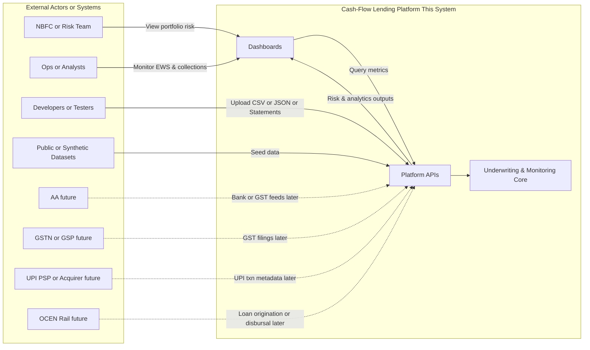

### 3A.2 C4 Level 2 — Container Diagram
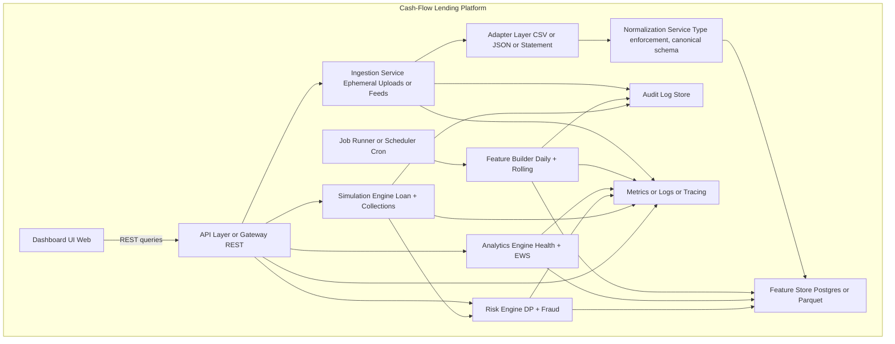

### 3A.3 C4 Level 3 — Component Diagram (Risk Engine)
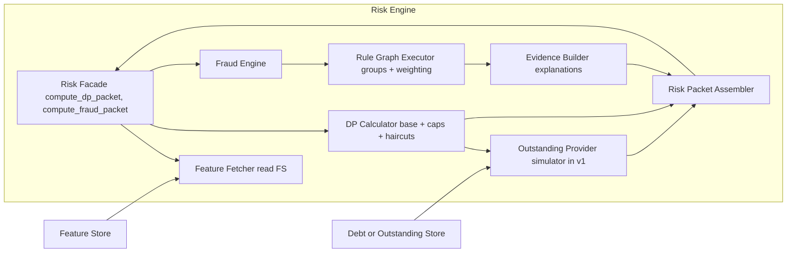

### 3A.4 C4 Level 3 — Component Diagram (Analytics Engine)
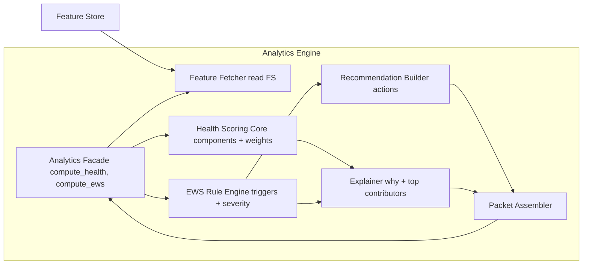

### 3A.5 C4 Level 3 — Component Diagram (Feature Builder)
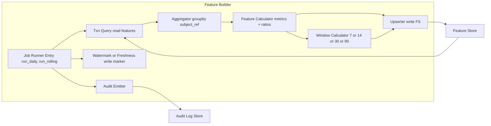

### 3A.6 C4 Level 3 — Component Diagram (Ingestion + Normalization)
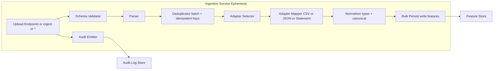

## 3C. Deployment Diagram (Streaming-Ready)

### 3C.3 Streaming-Ready (Near real-time features)
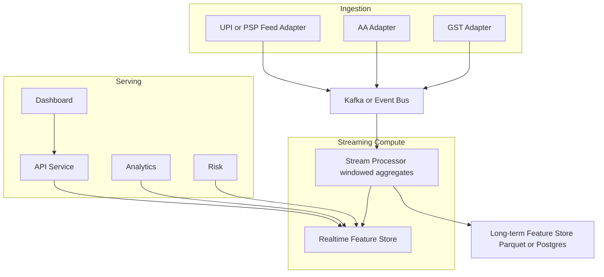

## 3D. Data Lineage Diagram
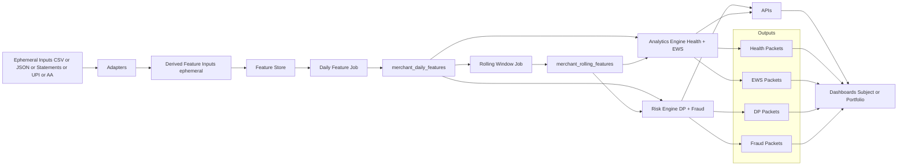

## 13A. Component-Level Sequence Diagrams

### 13A.3 Daily Feature Job — Compute + Write + Freshness Marker
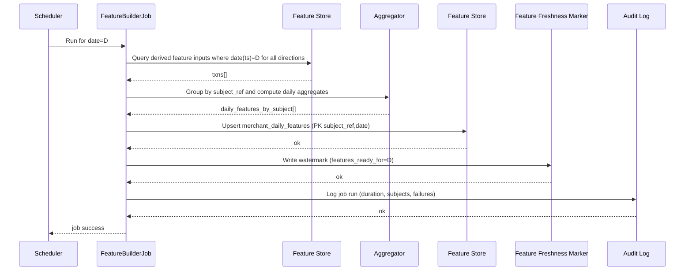

## 13B. Canonical Diagrams (C4 + Code-Level)

### 13B.1 System Context Diagram (C4 – Level 1)
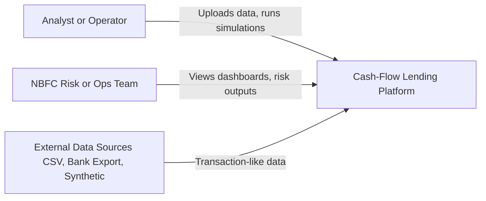

### 13B.2 Fraud Rule Graph Executor — Code-Level Structure
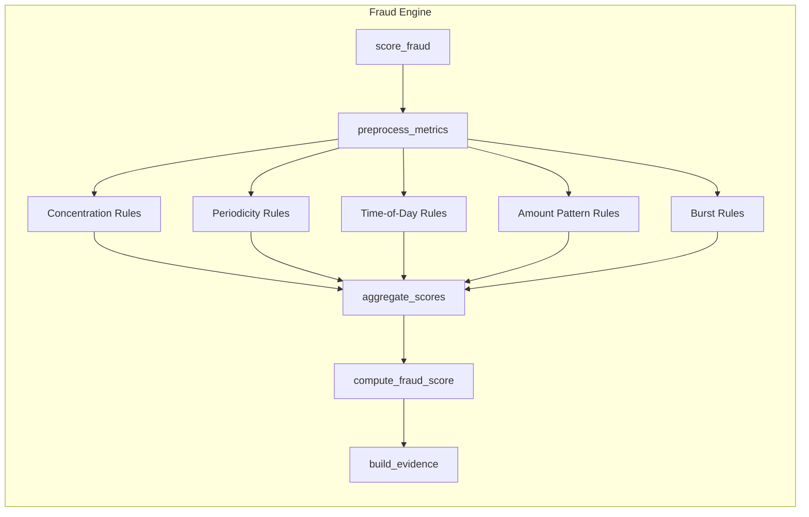

### 13B.3 Window Calculator — Code-Level Structure
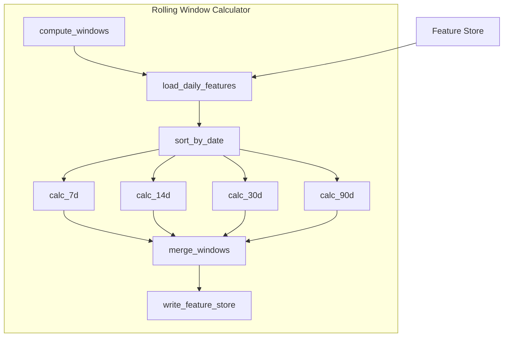

---

## Cash Control (CCT) Layer — NEW Canonical Step

This platform measures **repayment-relevant cash**, not just “money that touched the account.”

### Key idea
During ingestion, we classify each transaction ephemerally into a **Cash Control Type (CCT)**:

- **FREE**: discretionary cash that can service debt
- **CONSTRAINED**: mandatory operational outflows (inventory, rent, utilities)
- **PASS_THROUGH**: settlements, fees, refunds, reversals (do not count as revenue)
- **ARTIFICIAL**: owner infusions/withdrawals (dependency signal)
- **CONDITIONAL**: reimbursements/claims/subsidies (timing risk)
- **UNKNOWN**: low-confidence classification (risk flag)

**Compliance:** CCT is derived in-memory using statement text/tags if available, then **discarded**. Only **derived aggregates** per day/window are stored.

### What changes downstream
- Feature store persists **control-bucket aggregates** (e.g., `free_in_sum`, `constrained_out_sum`, `owner_dependency_ratio`).
- DP, EWS, and Fraud consume **FREE cash stability** and **owner-dependence** as first-class metrics.
